# SCHOOLS CRUD
Laravel Bootstrap Vuejs JWT API CRUD for Schools and Students

Prerequisitos de software que hay que tener instalado:  

Git  
PHP 7  
Nodejs  
Composer 2.0  
MySQL  

## INSTALACIÓN

Clonamos el repositorio:
```bash
git clone https://github.com/gasel/schools_crud.git
```

Instalar los paquetes necesarios de Laravel que usa el proyecto:
composer update

Se usa el paquete Intervention para manipulación de imágenes. Si aparece algún error, probablemente habrá que activar la extensión de PHP "ext-fileinfo", en el fichero de configuración de PHP "php.ini".

Permisos de carpetas:
Hay que otorgar permiso de escritura a la carpeta storage.

Editamos el fichero de configuración de Larabel .env, indicando nuestro usuario y password de nuestra base de datos local
Actualizamos la caché de configutación:
```bash
php artisan config:cache
php artisan route:cache
```

Creamos un enlace a la carpeta storage con el comando:

```bash
php artisan storage:link
```

Para gestionar la base de datos lo podemos hacer con phpMyAdmin, si lo tenemos instalado, o cualquier otro gestor que nos guste, como por ejemplo HeidiSQL.

- Creamos la base datos en el servidor de MySQL local "schools_crud" con codificación "utf8mb4_unicode_ci".
- Ejecutamos las migraciones de Laravel con:

```bash
php artisan migrate
```

Inertamos el registro de usuario administrador, con usuario admin@admin.com y contraseña password, con la sentencia INSERT siguiente:

```SQL
INSERT INTO `users` (`id`, `name`, `email`, `email_verified_at`, `password`, `remember_token`, `created_at`, `updated_at`, `role`) VALUES
(2, 'Admin', 'admin@admin.com', NULL, '$2y$10$3avP.nK7d1AbGsXdocQh3eIDYXsAYRlRAUbji/xnIPDae72CBk7e.', NULL, '2020-09-01 06:49:40', '2020-09-01 06:49:40', 'admin');
```

También podemos utilizar una copia con datos para la base de datos (situada en la carpeta "database/backup"), generada previamente, para rellenarla con escuelas y alumnos de ejemplo. O ejecutar las seeds nosotros mismos. En la misma carpeta ("database/backup"), tenemos las imágenes correspondientes a los logos de escuelas generadas automáticamente, que deberemos copiar a la carpeta "storage\app\public", si queremos utilizarlas.


Instalar las dependencias de node:

```bash
npm install
```

Generar los ficheros comprimidos de frontend:

En desarrollo:
```bash
npm run dev
```
En producción:
```bash
npm run prod
```

La aplicación está configurada para usarse en la máquina local (127.0.0.1), en el puerto 8000.
Como servidor se pueden usar varios, pero por ejemplo en este caso vamos a usar el que lleva Laravel, para lanzarlo lo haremos con el comando desde la raíz del proyecto (por defecto lo sirve en el puerto 8000):

```bash
php artisan serve
```

Y para acceder a la aplicación abrimos en nuestro navegador favorito la URL: http://127.0.0.1:8000


## DESCRIPCIÓN DEL PROYECTO

En este proyecto se pretende:

Utilizar Laravel para administrar escuelas y sus alumnos:  
  - Una escuela tendrá como mínimo los siguientes campos:
    * Nombre (requerido)
    * Dirección (requerido)
    * Logotipo (mínimo 200x200 y como máximo 2MB)
    * Correo electrónico
    * Teléfono
    * Página web
  - Un alumno tendrá como mínimo:
    * Nombre (requerido)
    * Apellidos (requerido)
    * Fecha de nacimiento (requerido)
    * Ciudad
    * Escuela (clave foranea a escuela)
  - Usar las migraciones y los Seeds de Laravel para crear el esquema anterior de modelo de datos
  - Usar los Resource Controller de Laravel para crear la funcionalidad CRUD de los modelos, creando el menú y los botones necesarios para gestionar cada uno de ellos.
  - Usar la paginación para mostrar las listas de cada uno
  - Guardar los logotipos de las escuelas para que sean públicos.
  - Crear un usuario administrador que pueda entrar a la gestión y pueda administrar las escuelas y los alumnos, con usuario admin@admin.com y contraseña password.
  - Utilizar un diseño Bootstrap para que sea adaptativo


## IMPLEMENTACIÓN

Se ha decidido hacer la aplicación en forma de __SPA__ (Single Page Application), haciendo el frontend con Vue y separar el backend mediante el acceso a los datos a través de __API__, implementada con el paquete __JWT__. No se ha hecho una gestión avanzada de usuarios con policies y gates, solo hay dos tipos de usuario (user y admin), indicado en el campo 'role' de la tabla 'users'. No se ha implementado la verificación del usuario a través de email.

Se ha utilizado el scaffolding por defecto de Laravel 7 con Vue para la autenticación, para adaptarlo despúes a la aquitectura con API.

En el frontend se ha utilizado el paquete [Websanova Vue Auth](https://websanova.com/docs/vue-auth/intro) para la gestión de autenticación ([gitHub](https://github.com/websanova/vue-auth)), peticiones AJAX con Axios, los toast y notficaciones con Sweetalert2 y una barra de progreso horizontal, al estilo "Youtube", para temporizar las llamadas.

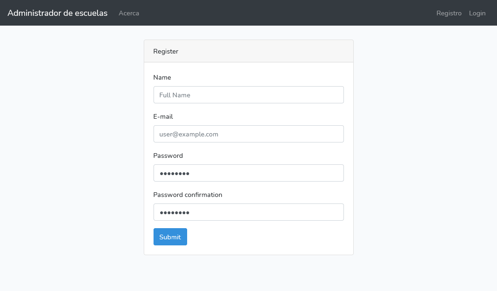
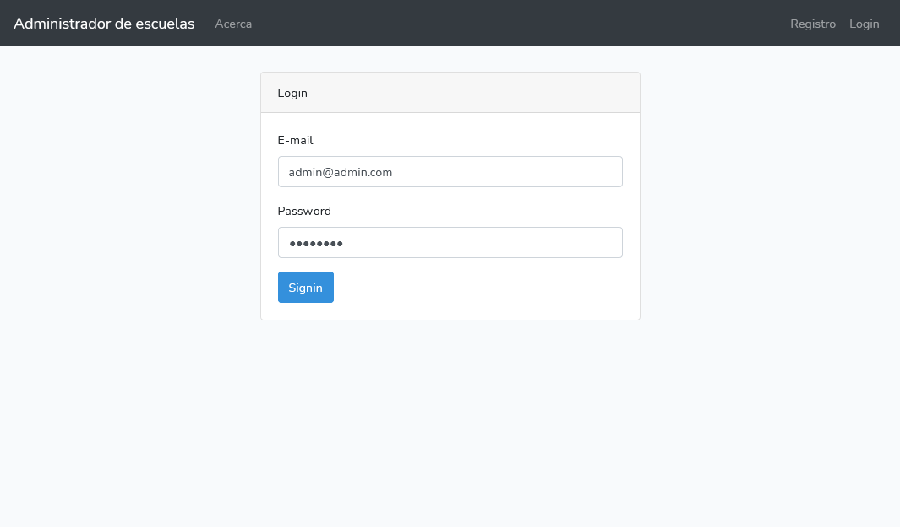
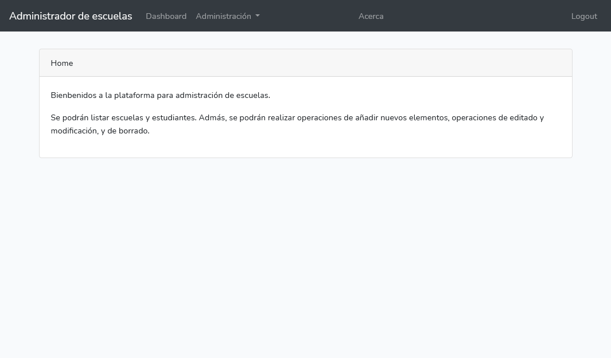
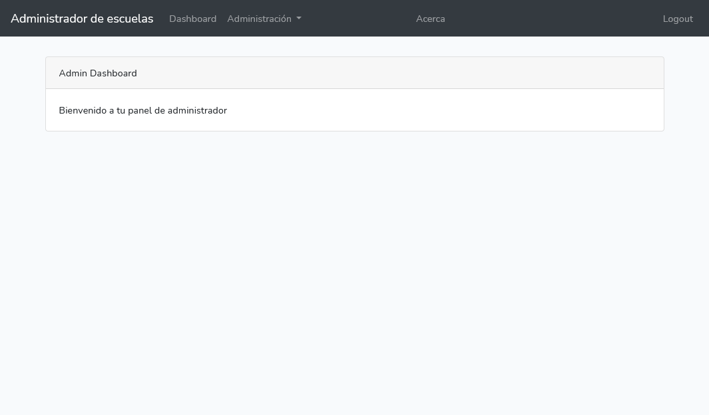
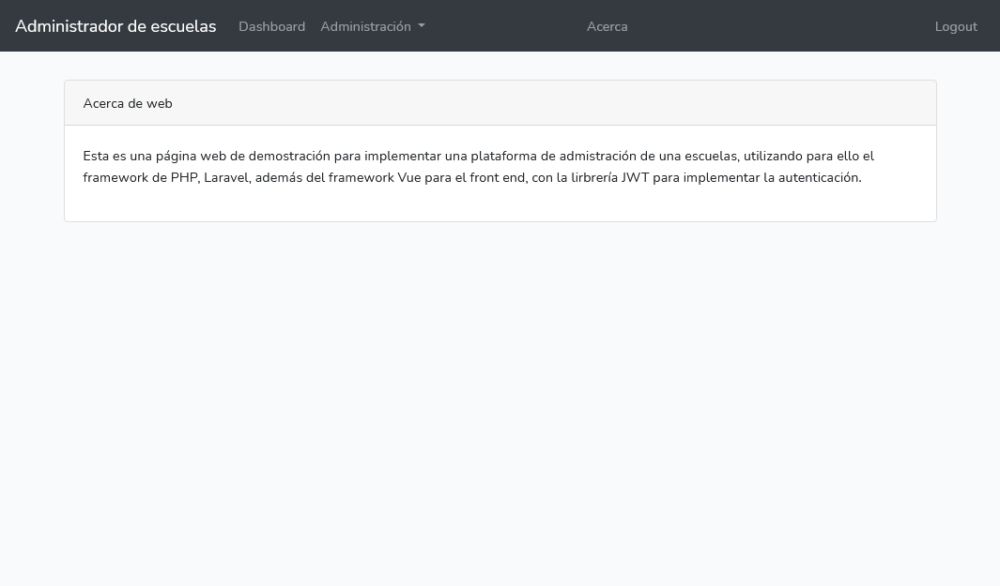
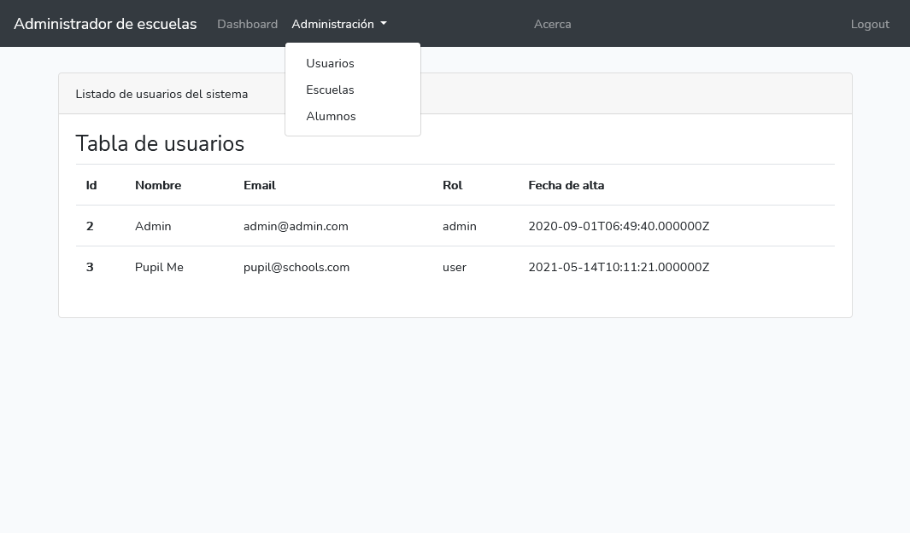
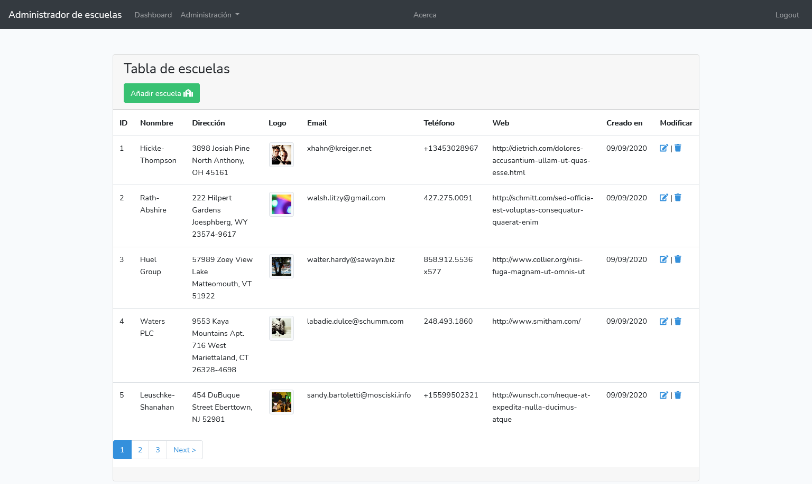
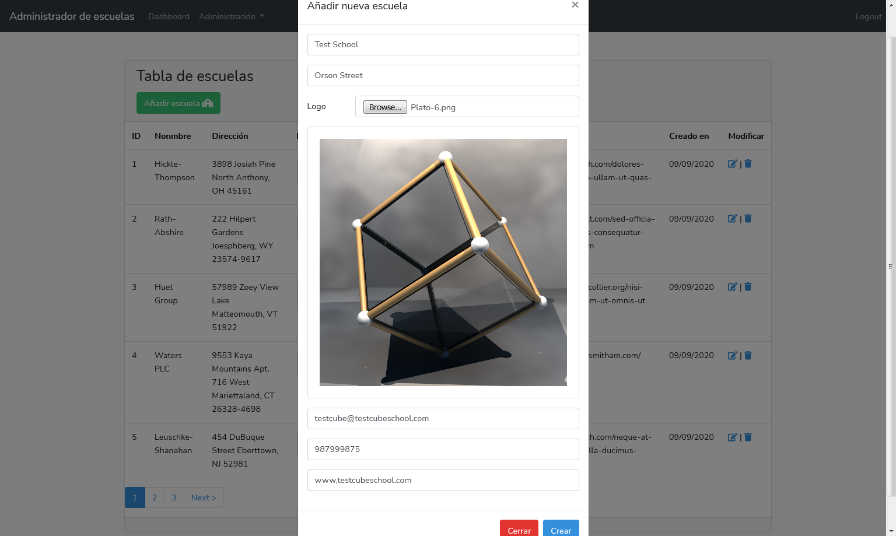
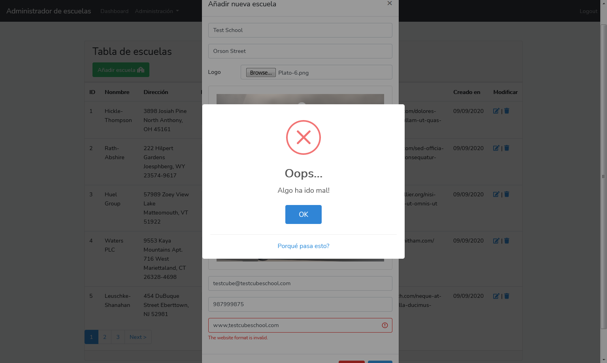
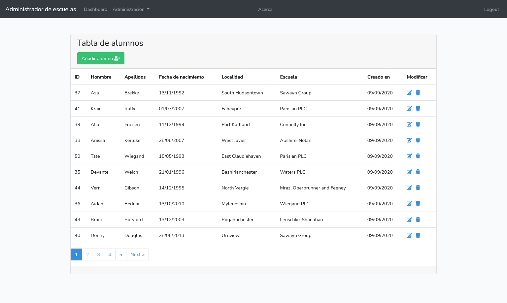
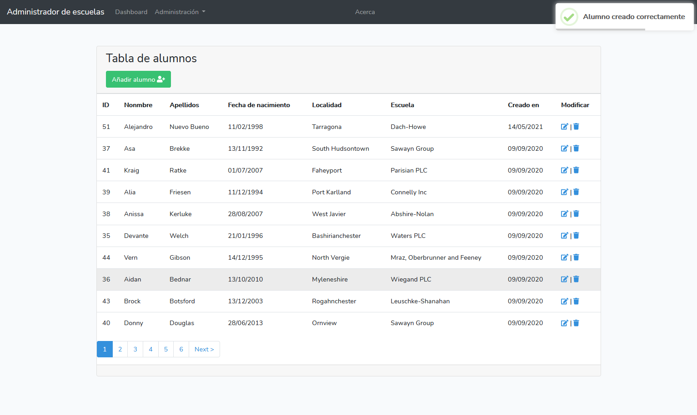
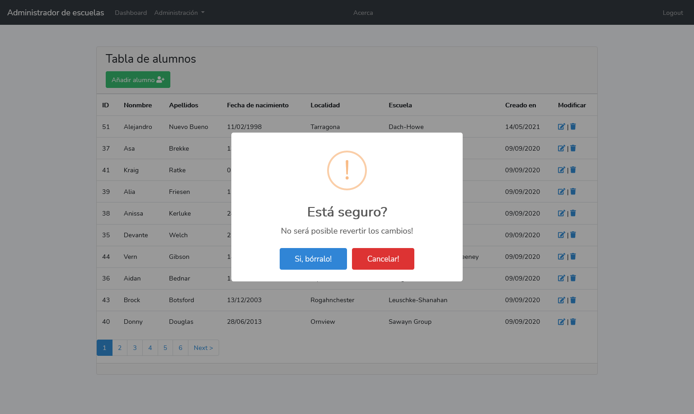
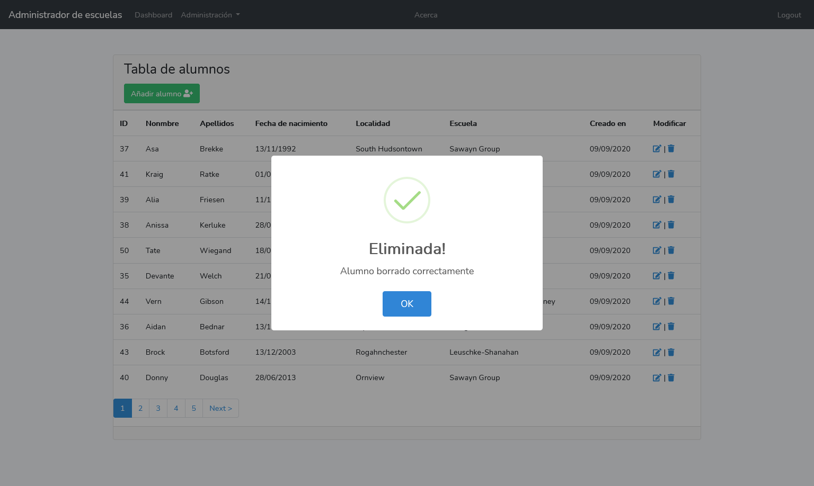

Principales inconvenientes encontrados durante el desarrollo:
- Validación de campo dependiente de otro y obligatorio.
- "Hack" parámetro _method en llamada PUT desde formulario HTML.
- El componente de calendario siempre devuelve la fecha en formato largo.
- Al generar la imagen del logo con los seeders, la generación con el paquete faker no funcionaba. Se ha sustituido la funcionalidad con una clase 'helper'.

Posibles mejoras para el futuro:

- Fechas con formatos correctos en la lista de usuarios utilizando utlizando el paquete Carbon.
- Utilizar Bootstrap Datatables para las tablas de registros y una gestión más eficiente de estos.
- Utilizar Dropzone en los selectores de imágenes en los formularios.
- Añadir un infinite loading que muestre un grid con todas las escuelas con su logo en la pantalla principal (para cualquier usuario, incluso público).


